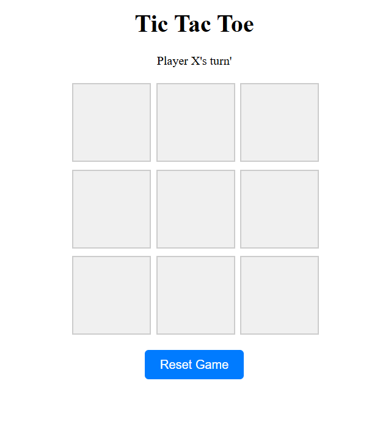
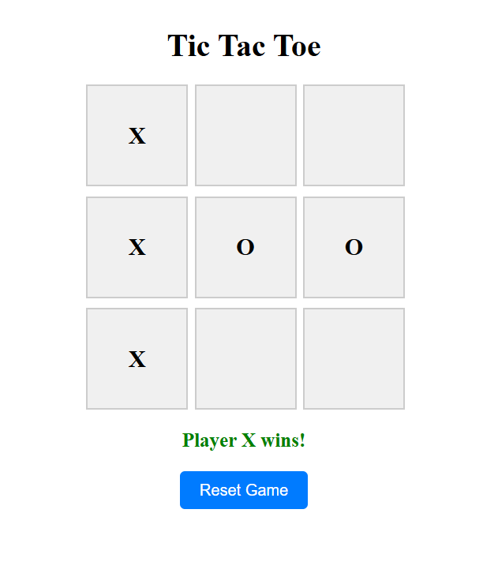
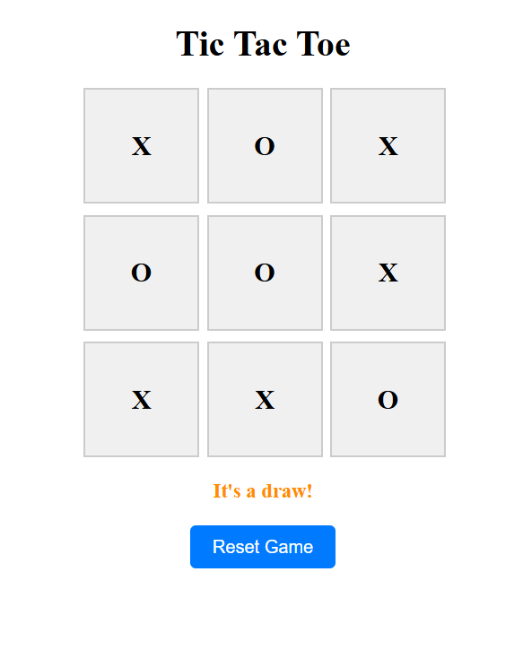

# Angular Tic Tac Toe Game 🎮❌⭕️

This is a classic **Tic Tac Toe** game built using **Angular 19**. Two players take turns marking spaces in a 3×3 grid, aiming to be the first to align three of their symbols (X or O) either vertically, horizontally, or diagonally. The game provides real-time updates, draw detection, and the option to reset and play again.

---

## 🔧 What I Built

I developed a clean and responsive **Tic Tac Toe** component using:

- Angular CLI 19.1.8
- Component-based structure with standalone components
- Real-time UI updates using Angular data binding
- Smart game logic for winner detection and draw condition
- Conditional rendering using `*ngIf`
- SCSS styling to create a visually appealing board

---

## 💡 Key Features

- Two-player turn-based gameplay (X and O)
- Automatic winner detection after every move
- Draw detection when the board is full
- Turn indicator showing whose move it is
- Clean UI with dynamic game messages
- Reset button to start a new game

---

## 🧱 Technologies Used

- **Angular 19**
- **TypeScript**
- **Standalone Components**
- **HTML & SCSS**
- **Conditional Rendering** with `*ngIf`
- **Array manipulation** for game state management

---

## 📁 Project Structure

```plaintext
src/
├── app/
│   └── tic-tac-toe/
│       ├── tic-tac-toe.component.ts       # Core game logic
│       ├── tic-tac-toe.component.html     # UI markup
│       ├── tic-tac-toe.component.scss     # Component styling

```

## 📸 Screenshot





---
## Development server

To start a local development server, run:

```bash
ng serve
```

Once the server is running, open your browser and navigate to `http://localhost:4200/`. The application will automatically reload whenever you modify any of the source files.